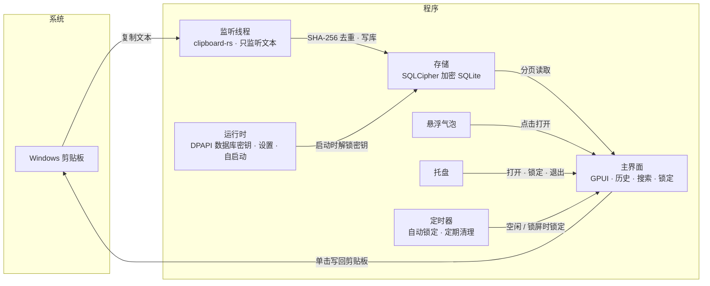

# 剪贴板时间胶囊 / Clipboard Time Capsule

**版本 1.0.0 · Version 1.0.0**

Windows 上的本地文本剪贴板历史工具。复制过的文字自动留档、加密存放在本机，需要时点一下就能重新放回剪贴板。

A local clipboard history tool for text on Windows. Every piece of text you copy is automatically archived and stored encrypted on your own machine; click an entry to put it back on the clipboard whenever you need it.

- 只记录纯文本，不读图片和文件，也不记录内容来自哪个程序
  Records plain text only — no images or files, and no record of which app the content came from
- 不联网，没有同步、账号、在线更新和统计
  No network access — no sync, accounts, online updates, or telemetry
- 不模拟按键粘贴，也不注册全局热键；复制后由你自己粘贴
  No simulated keystroke pasting and no global hotkeys; you paste yourself after copying

<!-- 截图：建议放一张主界面截图到 docs/images/，再在这里引用 -->
<!-- Screenshot: consider placing a main window screenshot in docs/images/ and referencing it here -->

## 功能 / Features

- **历史记录 / History**：自动记录复制的文字；重复内容只更新"最近复制时间"，不会刷屏
  Automatically records copied text; duplicates only update the "last copied" time instead of flooding the list
- **搜索和标记 / Search & tags**：关键词搜索，7 种颜色标记和颜色筛选，置顶
  Keyword search, 7 color tags with color filtering, and pinning
- **快捷删除 / Quick delete**：悬停一键删除，Ctrl/Shift 多选批量删除，5 秒内可撤销
  One-click delete on hover, Ctrl/Shift multi-select batch delete, undo within 5 seconds
- **自动清理 / Auto cleanup**：默认保留 7 天（可调 1–30 天）；数据库超过 200 MB 时从最旧的开始清理；置顶内容不会被自动清理
  Keeps 7 days by default (adjustable 1–30 days); when the database exceeds 200 MB, the oldest entries are cleaned first; pinned entries are never auto-cleaned
- **界面锁 / Interface lock**：主密码保护界面，空闲 10 分钟（可调）或 Windows 锁屏时自动锁定；锁定期间照常记录
  Master password protects the interface; auto-locks after 10 minutes idle (adjustable) or on Windows lock; recording continues while locked
- **悬浮气泡 / Floating bubble**：可拖到屏幕任意位置，靠近屏幕边缘时自动贴边；点一下打开历史窗口
  Can be dragged anywhere on screen and snaps to the edge when close to it; click to open the history window
- **其他 / Misc**：跟随系统深浅色，开机自动启动，托盘菜单
  Follows system light/dark mode, auto-start on boot, tray menu

## 下载与运行 / Download & Run

在 [Releases](../../releases) 下载 `clipboard-time-capsule.exe`，双击运行即可，不需要安装，也不依赖额外的运行库。

Download `clipboard-time-capsule.exe` from [Releases](../../releases) and double-click to run — no installation required and no extra runtime dependencies.

- 系统 / OS：Windows 10 / 11，x64
- 程序没有代码签名，首次运行时 Windows SmartScreen 可能提示"已保护你的电脑"，点"更多信息 → 仍要运行"
  The program is not code-signed, so Windows SmartScreen may show "Windows protected your PC" on first run — click "More info → Run anyway"
- 首次启动需要设置主密码（至少 6 位，输入两次），可以填一条密码提示
  On first launch, set a master password (at least 6 characters, entered twice); you may add a password hint

## 使用 / Usage

| 操作 / Action | 方式 / How |
|---|---|
| 打开历史窗口 / Open history window | 点悬浮气泡，或托盘菜单"打开" / Click the floating bubble, or "Open" in the tray menu |
| 复制某条到剪贴板 / Copy an entry to clipboard | 单击该条 / Click the entry |
| 标颜色 / 置顶 / 删除 / Color tag · pin · delete | 右键该条，或点左侧色点 / Right-click the entry, or click the color dot on the left |
| 删除单条 / Delete a single entry | 鼠标悬停，点右侧 × / Hover and click the × on the right |
| 多选 / Multi-select | Ctrl+单击 加选；Shift+单击 选一段 / Ctrl+click to add, Shift+click to select a range |
| 批量删除 / Batch delete | 多选后点底部"删除"，或按 Delete（置顶条目会被跳过）/ After multi-select, click "Delete" at the bottom or press Delete (pinned entries are skipped) |
| 撤销删除 / Undo delete | 点底部提示里的"撤销"，或按 Ctrl+Z（5 秒内）/ Click "Undo" in the bottom hint or press Ctrl+Z (within 5 seconds) |
| 全选 / 取消选择 / Select all · deselect | Ctrl+A / Esc |
| 按颜色筛选 / Filter by color | 点顶部色点，再点一次取消 / Click a color dot at the top; click again to clear |
| 锁定 / Lock | 右上角锁图标，或托盘菜单"锁定" / Lock icon at the top right, or "Lock" in the tray menu |
| 显示 / 隐藏气泡 / Show · hide bubble | 托盘菜单 / Tray menu |
| 退出 / Quit | 托盘菜单"退出" / "Quit" in the tray menu |

快捷键在焦点位于列表时生效，在搜索框里打字不受影响。最小化窗口会收起到气泡，不会锁定。

Shortcuts work when the list has focus; typing in the search box is unaffected. Minimizing the window collapses it into the bubble without locking.

## 数据与隐私 / Data & Privacy

数据保存在 `%LOCALAPPDATA%\ClipboardTimeCapsule\`：

Data is stored in `%LOCALAPPDATA%\ClipboardTimeCapsule\`:

| 文件 / File | 内容 / Contents |
|---|---|
| `history.db` | 剪贴板历史，SQLCipher 加密 / Clipboard history, encrypted with SQLCipher |
| `database-key.dpapi` | 数据库密钥，由 Windows DPAPI 按当前用户加密 / Database key, encrypted by Windows DPAPI for the current user |
| `settings.json` | 主密码的 Argon2id 哈希、密码提示、各项设置、气泡位置 / Master password Argon2id hash, password hint, settings, bubble position |
| `application.log` | 运行日志，不含剪贴板内容 / Runtime log, contains no clipboard content |

需要了解的安全边界：

Security boundaries you should know:

- **主密码是界面锁，不是数据库密码。** 数据库密钥由 Windows 当前用户保护，开机后程序在后台自动解开，所以锁定时也能继续记录。它能防止别人在你离开时翻看历史，但防不了以你的 Windows 账户运行的恶意程序。
  **The master password is an interface lock, not the database password.** The database key is protected by the current Windows user and is automatically unlocked in the background at startup, so recording continues while locked. It prevents others from peeking at your history while you're away, but cannot stop malware running under your Windows account.
- 数据库文件拷到别的电脑或别的 Windows 用户下无法解密。
  The database file cannot be decrypted when copied to another computer or another Windows user.
- **忘记主密码无法找回。** 只能退出程序后删除上面整个文件夹重新开始，历史会一并丢失。
  **A forgotten master password cannot be recovered.** You can only quit the program, delete the entire folder above, and start over — the history will be lost along with it.

## 卸载 / Uninstall

1. 托盘菜单"退出" / "Quit" in the tray menu
2. 删除 exe / Delete the exe
3. 删除 `%LOCALAPPDATA%\ClipboardTimeCapsule\`（会清空所有历史）/ Delete `%LOCALAPPDATA%\ClipboardTimeCapsule\` (this clears all history)
4. 开机启动项：任务管理器 → 启动应用 → 禁用"剪贴板时间胶囊"，或删除注册表 `HKCU\Software\Microsoft\Windows\CurrentVersion\Run` 下的 `ClipboardTimeCapsule`
   Startup entry: Task Manager → Startup apps → disable "剪贴板时间胶囊", or delete `ClipboardTimeCapsule` under the registry key `HKCU\Software\Microsoft\Windows\CurrentVersion\Run`

不想开机启动的话，在任务管理器里禁用即可，程序下次运行不会重新打开它。

To disable auto-start, simply disable it in Task Manager; the program won't re-enable it on next run.

## 从源码构建 / Building from Source

目前只在 `x86_64-pc-windows-gnu` 工具链下验证过，因此不提供源码。

Currently only verified with the `x86_64-pc-windows-gnu` toolchain, so source code is not provided.

## 架构 / Architecture

## 许可 / License

版权所有 © 2026 moequan。保留所有权利。

Copyright © 2026 moequan. All rights reserved.

本软件依据 **知识共享署名-非商业性使用-禁止演绎 4.0 国际许可协议（CC BY-NC-ND 4.0）** 发布：
This software is released under the **Creative Commons Attribution-NonCommercial-NoDerivatives 4.0 International License (CC BY-NC-ND 4.0)**:

- ✅ 您可以自由分享本软件，但必须署名原作者 **moequan**
  You may freely share this software, but you must give appropriate credit to the author **moequan**
- 🚫 禁止将本软件用于任何商业目的
  Commercial use of this software is prohibited
- 🚫 禁止改编、混编或以本软件为基础创作演绎作品后重新发布
  You may not remix, transform, or build upon this software and redistribute the modified material

完整许可文本 / Full license text: https://creativecommons.org/licenses/by-nc-nd/4.0/
