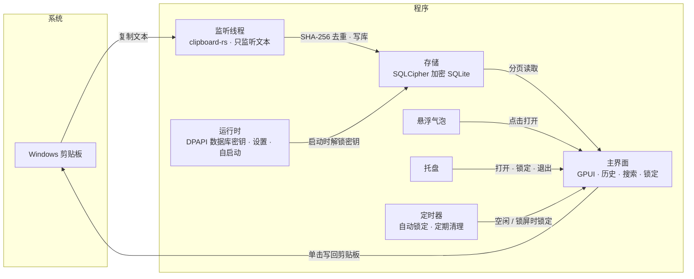

# 剪贴板时间胶囊

[English](README_EN.md)

**版本 1.0.0**

Windows 上的本地文本剪贴板历史工具。复制过的文字自动留档、加密存放在本机，需要时点一下就能重新放回剪贴板。

- 只记录纯文本，不读图片和文件，也不记录内容来自哪个程序
- 不联网，没有同步、账号、在线更新和统计
- 不模拟按键粘贴，也不注册全局热键；复制后由你自己粘贴

<!-- 截图：建议放一张主界面截图到 docs/images/，再在这里引用 -->

## 功能

- **历史记录**：自动记录复制的文字；重复内容只更新"最近复制时间"，不会刷屏
- **搜索和标记**：关键词搜索，7 种颜色标记和颜色筛选，置顶
- **快捷删除**：悬停一键删除，Ctrl/Shift 多选批量删除，5 秒内可撤销
- **自动清理**：默认保留 7 天（可调 1–30 天）；数据库超过 200 MB 时从最旧的开始清理；置顶内容不会被自动清理
- **界面锁**：主密码保护界面，空闲 10 分钟（可调）或 Windows 锁屏时自动锁定；锁定期间照常记录
- **悬浮气泡**：可拖到屏幕任意位置，靠近屏幕边缘时自动贴边；点一下打开历史窗口
- **其他**：跟随系统深浅色，开机自动启动，托盘菜单

## 下载与运行

在 [Releases](../../releases) 下载 `clipboard-time-capsule.exe`，双击运行即可，不需要安装，也不依赖额外的运行库。

- 系统：Windows 10 / 11，x64
- 程序没有代码签名，首次运行时 Windows SmartScreen 可能提示"已保护你的电脑"，点"更多信息 → 仍要运行"
- 首次启动需要设置主密码（至少 6 位，输入两次），可以填一条密码提示

## 使用

| 操作 | 方式 |
|---|---|
| 打开历史窗口 | 点悬浮气泡，或托盘菜单"打开" |
| 复制某条到剪贴板 | 单击该条 |
| 标颜色 / 置顶 / 删除 | 右键该条，或点左侧色点 |
| 删除单条 | 鼠标悬停，点右侧 × |
| 多选 | Ctrl+单击 加选；Shift+单击 选一段 |
| 批量删除 | 多选后点底部"删除"，或按 Delete（置顶条目会被跳过） |
| 撤销删除 | 点底部提示里的"撤销"，或按 Ctrl+Z（5 秒内） |
| 全选 / 取消选择 | Ctrl+A / Esc |
| 按颜色筛选 | 点顶部色点，再点一次取消 |
| 锁定 | 右上角锁图标，或托盘菜单"锁定" |
| 显示 / 隐藏气泡 | 托盘菜单 |
| 退出 | 托盘菜单"退出" |

快捷键在焦点位于列表时生效，在搜索框里打字不受影响。最小化窗口会收起到气泡，不会锁定。

## 数据与隐私

数据保存在 `%LOCALAPPDATA%\ClipboardTimeCapsule\`：

| 文件 | 内容 |
|---|---|
| `history.db` | 剪贴板历史，SQLCipher 加密 |
| `database-key.dpapi` | 数据库密钥，由 Windows DPAPI 按当前用户加密 |
| `settings.json` | 主密码的 Argon2id 哈希、密码提示、各项设置、气泡位置 |
| `application.log` | 运行日志，不含剪贴板内容 |

需要了解的安全边界：

- **主密码是界面锁，不是数据库密码。** 数据库密钥由 Windows 当前用户保护，开机后程序在后台自动解开，所以锁定时也能继续记录。它能防止别人在你离开时翻看历史，但防不了以你的 Windows 账户运行的恶意程序。
- 数据库文件拷到别的电脑或别的 Windows 用户下无法解密。
- **忘记主密码无法找回。** 只能退出程序后删除上面整个文件夹重新开始，历史会一并丢失。

## 卸载

1. 托盘菜单"退出"
2. 删除 exe
3. 删除 `%LOCALAPPDATA%\ClipboardTimeCapsule\`（会清空所有历史）
4. 开机启动项：任务管理器 → 启动应用 → 禁用"剪贴板时间胶囊"，或删除注册表 `HKCU\Software\Microsoft\Windows\CurrentVersion\Run` 下的 `ClipboardTimeCapsule`

不想开机启动的话，在任务管理器里禁用即可，程序下次运行不会重新打开它。

## 从源码构建

目前只在 `x86_64-pc-windows-gnu` 工具链下验证过，因此不提供源码。

## 架构

## 许可

版权所有 © 2026 moequan。保留所有权利。

本软件依据 **知识共享署名-非商业性使用-禁止演绎 4.0 国际许可协议（CC BY-NC-ND 4.0）** 发布：

- ✅ 您可以自由分享本软件，但必须署名原作者 **moequan**
- 🚫 禁止将本软件用于任何商业目的
- 🚫 禁止改编、混编或以本软件为基础创作演绎作品后重新发布

完整许可文本：https://creativecommons.org/licenses/by-nc-nd/4.0/
