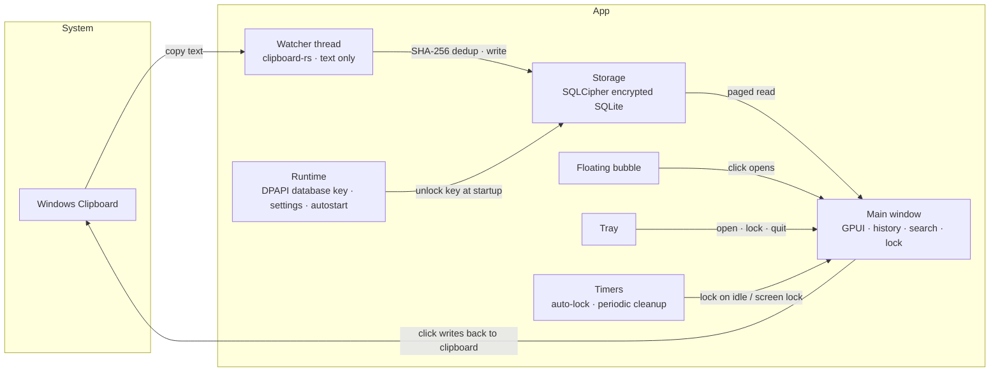

# Clipboard Time Capsule

[中文](README.md)

**Version 1.0.0**

A local clipboard history tool for text on Windows. Every piece of text you copy is automatically archived and stored encrypted on your own machine; click an entry to put it back on the clipboard whenever you need it.

- Records plain text only — no images or files, and no record of which app the content came from
- No network access — no sync, accounts, online updates, or telemetry
- No simulated keystroke pasting and no global hotkeys; you paste yourself after copying

<!-- Screenshot: consider placing a main window screenshot in docs/images/ and referencing it here -->

## Features

- **History**: automatically records copied text; duplicates only update the "last copied" time instead of flooding the list
- **Search & tags**: keyword search, 7 color tags with color filtering, and pinning
- **Quick delete**: one-click delete on hover, Ctrl/Shift multi-select batch delete, undo within 5 seconds
- **Auto cleanup**: keeps 7 days by default (adjustable 1–30 days); when the database exceeds 200 MB, the oldest entries are cleaned first; pinned entries are never auto-cleaned
- **Interface lock**: master password protects the interface; auto-locks after 10 minutes idle (adjustable) or on Windows lock; recording continues while locked
- **Floating bubble**: can be dragged anywhere on screen and snaps to the edge when close to it; click to open the history window
- **Misc**: follows system light/dark mode, auto-start on boot, tray menu

## Download & Run

Download `clipboard-time-capsule.exe` from [Releases](../../releases) and double-click to run — no installation required and no extra runtime dependencies.

- OS: Windows 10 / 11, x64
- The program is not code-signed, so Windows SmartScreen may show "Windows protected your PC" on first run — click "More info → Run anyway"
- On first launch, set a master password (at least 6 characters, entered twice); you may add a password hint

## Usage

| Action | How |
|---|---|
| Open history window | Click the floating bubble, or "Open" in the tray menu |
| Copy an entry to clipboard | Click the entry |
| Color tag · pin · delete | Right-click the entry, or click the color dot on the left |
| Delete a single entry | Hover and click the × on the right |
| Multi-select | Ctrl+click to add, Shift+click to select a range |
| Batch delete | After multi-select, click "Delete" at the bottom or press Delete (pinned entries are skipped) |
| Undo delete | Click "Undo" in the bottom hint or press Ctrl+Z (within 5 seconds) |
| Select all · deselect | Ctrl+A / Esc |
| Filter by color | Click a color dot at the top; click again to clear |
| Lock | Lock icon at the top right, or "Lock" in the tray menu |
| Show · hide bubble | Tray menu |
| Quit | "Quit" in the tray menu |

Shortcuts work when the list has focus; typing in the search box is unaffected. Minimizing the window collapses it into the bubble without locking.

## Data & Privacy

Data is stored in `%LOCALAPPDATA%\ClipboardTimeCapsule\`:

| File | Contents |
|---|---|
| `history.db` | Clipboard history, encrypted with SQLCipher |
| `database-key.dpapi` | Database key, encrypted by Windows DPAPI for the current user |
| `settings.json` | Master password Argon2id hash, password hint, settings, bubble position |
| `application.log` | Runtime log, contains no clipboard content |

Security boundaries you should know:

- **The master password is an interface lock, not the database password.** The database key is protected by the current Windows user and is automatically unlocked in the background at startup, so recording continues while locked. It prevents others from peeking at your history while you're away, but cannot stop malware running under your Windows account.
- The database file cannot be decrypted when copied to another computer or another Windows user.
- **A forgotten master password cannot be recovered.** You can only quit the program, delete the entire folder above, and start over — the history will be lost along with it.

## Uninstall

1. "Quit" in the tray menu
2. Delete the exe
3. Delete `%LOCALAPPDATA%\ClipboardTimeCapsule\` (this clears all history)
4. Startup entry: Task Manager → Startup apps → disable "剪贴板时间胶囊", or delete `ClipboardTimeCapsule` under the registry key `HKCU\Software\Microsoft\Windows\CurrentVersion\Run`

To disable auto-start, simply disable it in Task Manager; the program won't re-enable it on next run.

## Building from Source

Currently only verified with the `x86_64-pc-windows-gnu` toolchain, so source code is not provided.

## Architecture

## License

Copyright © 2026 moequan. All rights reserved.

This software is released under the **Creative Commons Attribution-NonCommercial-NoDerivatives 4.0 International License (CC BY-NC-ND 4.0)**:

- ✅ You may freely share this software, but you must give appropriate credit to the author **moequan**
- 🚫 Commercial use of this software is prohibited
- 🚫 You may not remix, transform, or build upon this software and redistribute the modified material

Full license text: https://creativecommons.org/licenses/by-nc-nd/4.0/
